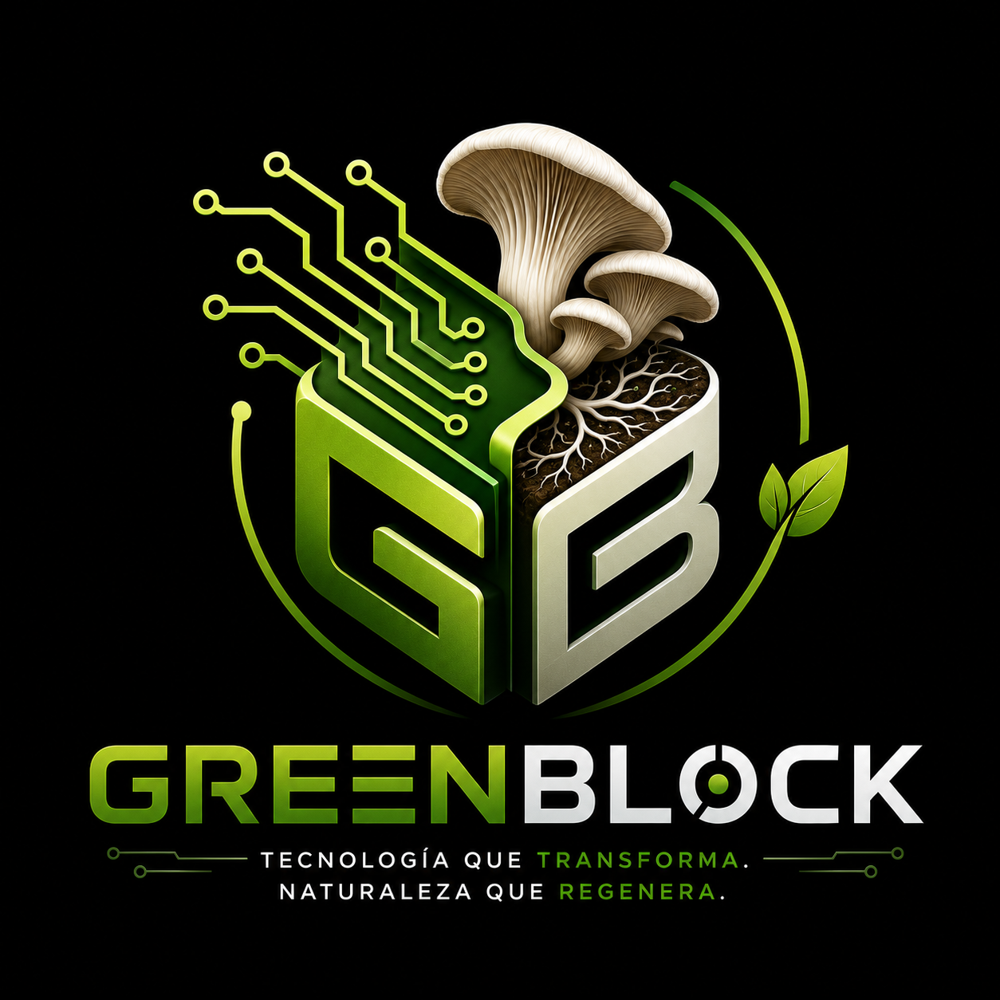
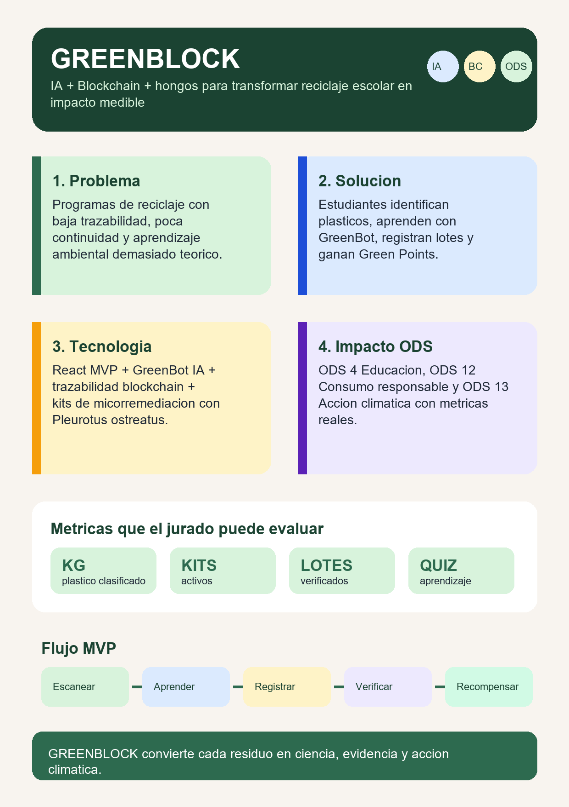

# GREENBLOCK

<p align="center">
  
</p>

<p align="center">
  <strong>Plataforma de ciencia ciudadana que transforma el reciclaje escolar en aprendizaje, trazabilidad e impacto medible mediante Inteligencia Artificial, Blockchain y micorremediación.</strong><br>
  Cada residuo puede convertirse en ciencia, evidencia y acción climática.
</p>

---

## Integrantes

| Integrante | Rol |
|---|---|
| Anthonela Terán | Líder del proyecto |
| Martin Pérez | Desarrollo Backend y Blockchain |
| Victoria Balastro | Desarrollo Frontend |
| Danna Velasco | Investigación y Biotecnología |
| Evelyn Cando | Mentora y asesora |

---

## Problema Que Se Quiere Resolver

La contaminación por plástico continúa creciendo mientras una parte reducida de estos residuos se recicla correctamente. En escuelas y comunidades, el problema no es solamente separar materiales: también faltan herramientas para identificar los tipos de plástico, mantener la participación y verificar qué ocurrió con cada residuo.

Los programas tradicionales suelen producir poca evidencia comparable. Esto dificulta medir el aprendizaje, reconocer la participación de los estudiantes y comunicar resultados ambientales confiables.

## Solución Propuesta

**GREENBLOCK** es una plataforma educativa que integra Inteligencia Artificial, trazabilidad Blockchain, gamificación y experimentación guiada con micorremediación.

La plataforma ayuda a los estudiantes a identificar residuos, aprender cómo tratarlos responsablemente, registrar lotes, seguir su trazabilidad y obtener **Green Points** por completar actividades verificables.

> La micorremediación se plantea como una experiencia educativa controlada. No todos los plásticos son compatibles y cualquier cultivo debe seguir protocolos de bioseguridad y supervisión adulta.

## Cómo Funciona

| Paso | Proceso |
|---|---|
| 1 | El estudiante identifica el residuo y consulta su tipo de plástico. |
| 2 | **GreenBot IA** explica compatibilidad, preparación y buenas prácticas. |
| 3 | El residuo se asocia con un kit o lote experimental supervisado. |
| 4 | La plataforma registra hitos, evidencia y hashes de trazabilidad. |
| 5 | El estudiante completa actividades y obtiene **Green Points**. |
| 6 | La institución consulta métricas de aprendizaje e impacto. |

## ODS Vinculados

| ODS | Nombre | Aplicación En GREENBLOCK |
|---|---|---|
| ODS 4 | Educación de Calidad | Convierte el aula en un espacio de ciencia ciudadana y aprendizaje STEM. |
| ODS 12 | Producción y Consumo Responsables | Promueve clasificación responsable, trazabilidad y medición de residuos. |
| ODS 13 | Acción por el Clima | Facilita acciones ambientales locales respaldadas por datos verificables. |

## Tecnologías

| Categoría | Tecnología |
|---|---|
| Frontend | React, Vite y Tailwind CSS |
| Componentes UI | Radix UI, Material UI y Lucide React |
| Datos del MVP | Contextos de React y datos demostrativos |
| Backend preparado | Node.js, Express o Firebase |
| Inteligencia Artificial | GreenBot educativo y arquitectura para visión artificial |
| Blockchain | Pasaporte digital de lotes y registro de hashes verificables |
| Biotecnología | Micorremediación experimental con *Pleurotus ostreatus* |
| Hosting previsto | Vercel, Netlify o GitHub Pages |
| Control de versiones | GitHub |

## Funcionalidades Principales

| Módulo | Descripción |
|---|---|
| Portal Público | Presenta el problema, la solución y la propuesta científica de GREENBLOCK. |
| Registro y Acceso | Flujo de autenticación demostrativo para estudiantes y administradores. |
| Solicitud de Kit | Catálogo y formulario para solicitar kits educativos. |
| Guía De Plásticos | Información sobre tipos de plástico, compatibilidad y preparación. |
| GreenBot IA | Asistente interactivo para dudas de reciclaje y micorremediación. |
| Mi Hongo | Seguimiento gamificado del proceso experimental. |
| Trazabilidad | Consulta de lotes, estados y hashes asociados con Blockchain. |
| Green Points | Sistema de puntos, progreso y recompensas educativas. |
| Tienda | Canje demostrativo de puntos por recompensas. |
| Panel Administrador | Gestión y visualización del estado general de la plataforma. |

## Arquitectura De La Plataforma

El MVP organiza la experiencia en una interfaz React con módulos de aprendizaje, kits, trazabilidad y recompensas. La arquitectura prevista conecta estos módulos con autenticación, base de datos, servicios de IA y un contrato de trazabilidad.

<p align="center">
  
</p>

## Impacto Esperado

- Mejorar el conocimiento sobre clasificación y consumo responsable.
- Medir gramos o kilogramos de plástico clasificado por curso y escuela.
- Registrar el porcentaje de lotes con evidencia completa.
- Evaluar aprendizaje mediante módulos y cuestionarios.
- Fortalecer proyectos escolares vinculados con IA, Blockchain y biotecnología.
- Generar reportes de impacto sin exponer información sensible de estudiantes.

## Seguridad Y Uso Responsable

- No almacenar claves de API, contraseñas ni tokens en el repositorio.
- Mantener datos personales fuera de la Blockchain.
- Usar la IA como apoyo educativo y permitir validación humana.
- Limitar los experimentos a materiales y protocolos autorizados.
- No presentar resultados experimentales como evidencia científica concluyente sin validación.

---

## Entregable 3

### MVP Web

La publicación pública está pendiente. El código fuente del MVP se encuentra en [`src/`](src/).

### Video Demo

Pendiente de grabación y publicación en YouTube, Loom o Google Drive.

### Pitch Deck

[Ver Pitch Deck GREENBLOCK](docs/pitch.pdf)

### Whitepaper

[Ver Whitepaper GREENBLOCK v1.0](docs/whitepaper_v1.pdf)

### Infografía

<p align="center">
  
</p>

### Investigación Y Documentación

- [Investigación de mercado](docs/investigacion/INVESTIGACI%C3%93N%20DE%20MERCADO.pdf)
- [Justificación de los ODS](docs/proyecto/JUSTIFICACI%C3%93N%20DE%20LOS%20ODS.pdf)
- [Roadmap inicial](docs/proyecto/roadmap_pdfsemana1_GREENBLOCK.pdf)
- [Material compartido del equipo en Drive](https://drive.google.com/drive/folders/1k4n_X-pdk2eGmemlzyJPLZfWxwc9F1rJ?usp=sharing)

## Ejecución Local

```bash
npm install
npm run dev
```

Para generar la versión de producción:

```bash
npm run build
```

